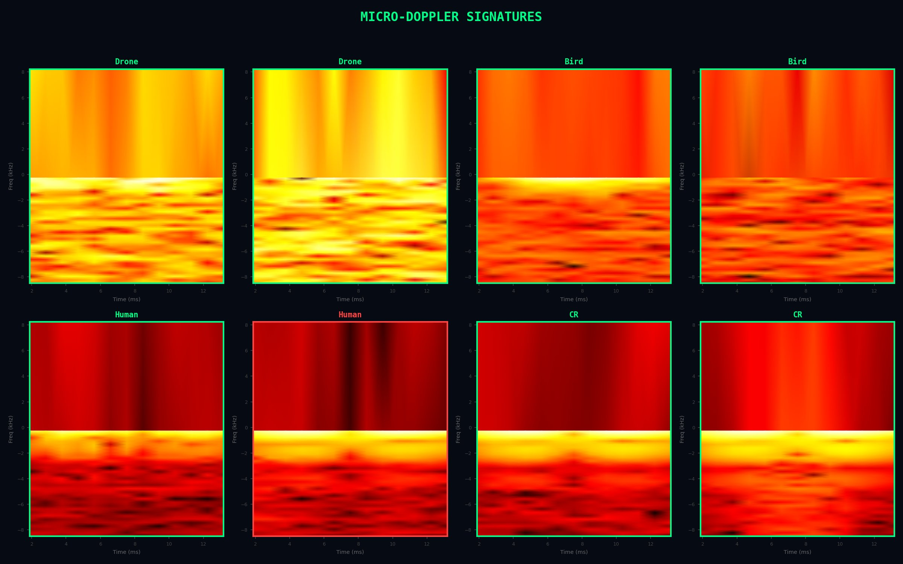
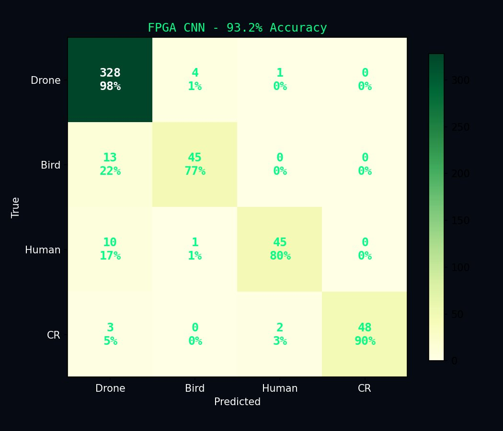
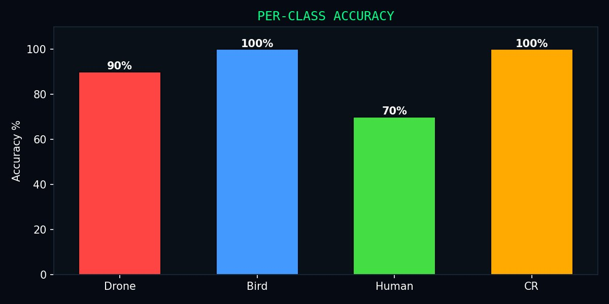
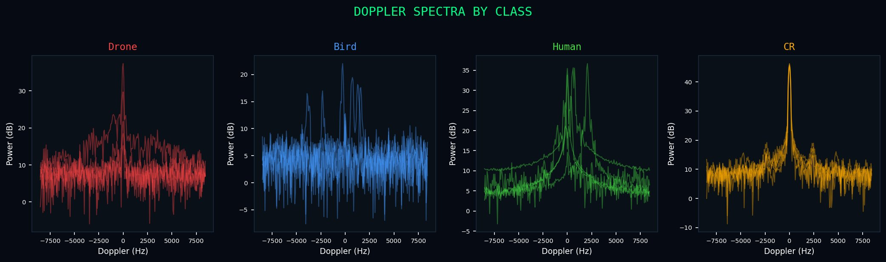
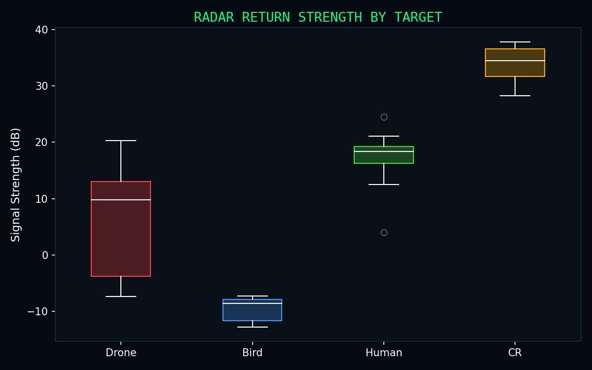
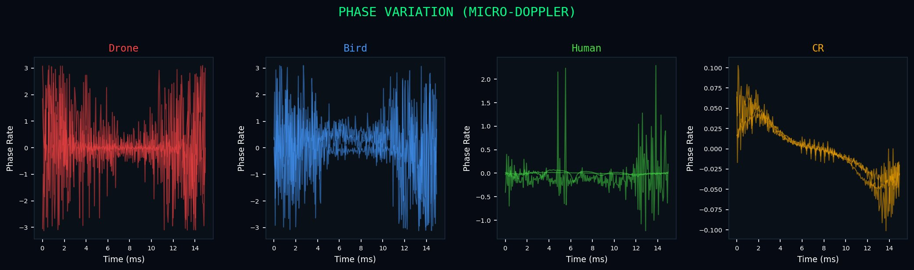

# FPGA-Based Radar Target Classification on PYNQ-Z2

**Real-time drone vs bird classification using a 1D CNN hardware accelerator on Zynq-7020 FPGA**


<p align="center">
  
  <br>
  <em>Micro-Doppler spectrograms of different radar targets — each class has a distinct signature</em>
</p>

---

## Motivation

Drones are becoming increasingly accessible, and with that comes security risks — unauthorized surveillance, smuggling, and even weaponization. Detecting drones using radar is a well-studied problem, but the challenge lies in **distinguishing drones from birds**, since both have similar radar cross-sections (RCS) and flight speeds. Traditional radar classification methods based on RCS and velocity alone are not sufficient.

I came across the paper by **Ertekin & Güney (2025)** — *"Classification of Targets by Using FMCW Radar Data With Machine Learning Techniques"* — which tackles this exact problem using micro-Doppler signatures from a 77 GHz FMCW radar. Their best approach (6-layer 2D CNN + SVM) achieved 98% accuracy. The dataset they used was originally collected by **Karlsson et al. at KTH Royal Institute of Technology** using a SAAB SIRS 1600 radar.

My goal was to **implement this on real edge hardware** — specifically a PYNQ-Z2 board — as a proof of concept for deploying radar-based AI classifiers on resource-constrained FPGA platforms.

## The Dataset

The dataset is publicly available from KTH ([Zenodo DOI: 10.5281/zenodo.5845259](https://doi.org/10.5281/zenodo.5845259)) and contains **75,868 radar scan segments** collected with a SAAB SIRS 1600 FMCW radar operating at 77 GHz.

Each segment is a **1280-element complex-valued vector** (5 range cells × 256 azimuth sweeps), capturing the In-phase and Quadrature (IQ) components of the reflected radar signal.

**Targets in the dataset:**
- 6 drone types (DJI Matrice 200v, Mavic 2 Pro, Phantom 3, custom FPV, Tarot 680 Pro, Syma X23W)
- 6 bird species (seagull, pigeon, raven, black-headed gull, heron, mixed)
- 2 human activities (walking, running)
- 1 corner reflector (100 m² RCS reference target)

For this project, I grouped these into **4 super-classes**: Drone, Bird, Human, and Corner Reflector.

## The Resource Constraint Challenge

The paper's 2D CNN processes 100×100 spectrogram images and requires ~800+ DSP slices. The PYNQ-Z2 board has a Zynq-7020 FPGA with only **220 DSP slices**, **53K LUTs**, and **140 BRAMs**.

**The 2D CNN simply does not fit.**

| Resource | PYNQ-Z2 Has | 2D CNN Needs | Verdict |
|----------|-------------|-------------|---------|
| DSP48E1  | 220         | ~800+       | ❌ Not enough |
| LUT      | 53,200      | ~60,000+    | ❌ Not enough |
| BRAM     | 140         | ~200+       | ❌ Not enough |

I had to completely rethink the approach. Instead of processing 2D spectrogram images, I designed a **1D CNN that operates on 64 extracted features** from the raw IQ data. This preserves the discriminative information (Doppler spectrum, range profile, phase variation) while being small enough to fit on the FPGA.

## System Architecture

```
┌─────────────────────────────────────────────────────────────┐
│                      Zynq-7020 SoC                          │
│                                                             │
│  ┌─────────────────────┐     ┌───────────────────────────┐  │
│  │   PS (ARM Cortex-A9) │     │   PL (FPGA Fabric)        │  │
│  │                      │     │                           │  │
│  │  • Load IQ data      │ AXI │  • 1D CNN Accelerator     │  │
│  │  • Extract 64 features│◄──►│  • Conv1(1→8) + ReLU      │  │
│  │  • Send via AXI-Lite  │Lite│  • Conv2(8→16) + ReLU     │  │
│  │  • Read prediction    │    │  • Conv3(16→16) + ReLU    │  │
│  │  • Control LEDs       │    │  • FC(64→4) + Argmax      │  │
│  │  • Generate plots     │    │  • INT8 quantized          │  │
│  │                      │     │  • ~1,500 parameters       │  │
│  └─────────────────────┘     └───────────────────────────┘  │
│                                        │                     │
│                                   AXI GPIO                   │
│                                   ┌──┬──┬──┬──┐             │
│                                   │L0│L1│L2│L3│             │
│                                   └──┴──┴──┴──┘             │
│                              Drone Bird Human CR             │
└─────────────────────────────────────────────────────────────┘
```

**Data flow for one classification:**
1. **PS** loads a 1280-element complex IQ vector
2. **PS** extracts 64 features: power spectrum (32), magnitude variance (16), per-cell statistics (15), phase difference (1)
3. **PS** packs 4 features per 32-bit word and writes to FPGA registers at `0x40–0x7F`
4. **PS** triggers the accelerator by writing to control register at `0x00`
5. **PL** runs the CNN: Conv1→Conv2→Conv3→FC→Argmax in hardware
6. **PS** reads the predicted class from register `0x10`
7. **PS** lights up the corresponding LED via AXI GPIO

## Feature Extraction

From each 1280-element complex IQ vector, I extract 64 features:

| Features | Count | What They Capture |
|----------|-------|-------------------|
| Power spectrum (FFT of center range cell, downsampled) | 32 | Doppler frequencies — drone rotors vs bird wings vs human gait |
| Magnitude variance across range cells | 16 | How the target's reflection changes across distance |
| Per-cell statistics (mean, std, dynamic range) | 15 | Signal strength patterns — CR is strong/stable, birds are weak/variable |
| Mean phase difference | 1 | Target motion — fast movers have large phase changes |

All features are normalized to [0, 255] for INT8 compatibility.

## Quantization: The Hardest Part

Converting a float32-trained model to INT8 fixed-point for FPGA was the most challenging part of this project. I went through three attempts:

**Attempt 1 — Naive INT8:** Rounded weights to int8 without considering activation ranges. Result: **35% accuracy**. The problem was that different layers have wildly different value ranges, and naive rounding destroys the decision boundaries.

**Attempt 2 — Right-shifts between layers:** Added `>> 7` after each layer to prevent overflow. Result: **55% accuracy**. Better, but the bias scaling formula was purely mathematical and didn't account for actual data distributions.

**Attempt 3 — Calibration-based quantization (what worked):** This is how production frameworks like TFLite and CMSIS-NN handle quantization:
1. Run 2,000 real training samples through the float model
2. Record the **actual maximum value** at each layer's output
3. Compute requantization multipliers: `M = (input_scale × weight_scale) / output_scale`
4. After each conv layer: `output = clamp((accumulator × M) >> 15, 0, 32767)`

This preserves the relative ordering of values (which is all argmax needs) while keeping everything in bounded integers.

## HLS Implementation

The CNN accelerator is written in C++ for Vivado HLS:

- **Weights:** `int8_t` arrays (from `weights.h`)
- **Biases:** `int32_t` (pre-scaled to match accumulator units)
- **Accumulators:** `long long` (64-bit to prevent overflow)
- **Requantization:** Multiply by M, right-shift by 15, clamp to [0, 32767]
- **Interface:** AXI-Lite with input at `0x40–0x7F` (4 features packed per word), output at `0x10`

Key challenge: the input features are stored as `int8_t` (range -128 to 127), but the original values are 0-255. Values above 127 wrap to negative. The HLS code recovers them with `if (val < 0) val += 256`.

### Resource Utilization

| Resource | Used | Available | Utilization |
|----------|------|-----------|-------------|
| DSP48E1  | 212  | 220       | 96%         |
| LUT      | 23,627 | 53,200  | 44%         |
| FF       | 8,564 | 106,400   | 8%          |
| BRAM     | 36   | 140       | 26%         |

## Results

<p align="center">
  
  
</p>

**Test accuracy on 500 real radar samples: 93.2%**

| Class | Accuracy | Samples |
|-------|----------|---------|
| Drone | 98%      | 333     |
| Bird  | 77%      | 58      |
| Human | 80%      | 56      |
| Corner Reflector | 90% | 53 |

**Speed:** 1.3 ms per inference (end-to-end including AXI transfer)

**FPGA vs ARM:** 141× speedup over ARM Cortex-A9 numpy implementation

### Signal Analysis

<p align="center">
  
</p>

The Doppler spectra clearly show why classification works:
- **Drones** have broadband Doppler spread from multiple rotating propellers
- **Birds** show narrower peaks from periodic wing flapping
- **Humans** have a strong zero-Doppler component (body) with sidebands (limb motion)
- **Corner reflectors** show a single sharp peak with no Doppler spread (static target)

<p align="center">
  
  
</p>

## Repository Structure

```
├── README.md
├── training/
│   ├── Step1_Feature_Extraction.ipynb    # IQ → 64 features
│   ├── Step2_Training.ipynb              # Train 1D CNN in PyTorch
│   └── Step3c_Calibrated_Export.py       # Calibration-based INT8 quantization
├── hls/
│   ├── cnn_accel.cpp                     # CNN accelerator (HLS C++)
│   ├── cnn_accel.h                       # Header
│   ├── cnn_accel_tb.cpp                  # Testbench with real radar data
│   └── run_hls.tcl                       # HLS automation script
├── vivado/
│   ├── build_vivado.tcl                  # Block design automation
│   └── leds.xdc                          # LED pin constraints for PYNQ-Z2
├── pynq/
│   ├── PYNQ_Final.ipynb                  # Main demo notebook (LED + GUI)
│   ├── pack_for_pynq.py                  # Extract small demo file from dataset
│   └── save_pynq_weights.py              # Export weights for PYNQ
├── results/
│   ├── confusion.png                     # Confusion matrix (93.2%)
│   ├── class_accuracy.png                # Per-class accuracy bars
│   ├── spectrograms.png                  # Micro-Doppler spectrograms
│   ├── doppler_spectra.png               # Doppler frequency analysis
│   ├── range_profiles.png                # Range cell magnitude profiles
│   ├── signal_strength.png               # Radar return power boxplot
│   ├── phase_variation.png               # Micro-Doppler phase signatures
│   ├── features_heatmap.png              # Feature vector visualization
│   ├── resources.png                     # FPGA utilization donuts
│   └── speed_hist.png                    # Inference latency histogram
└── docs/
    └── architecture.png                  # Vivado block design screenshot
```

## How to Reproduce

### Prerequisites
- Python 3.8+ with PyTorch, NumPy, SciPy, Matplotlib
- Vivado / Vitis HLS 2023.2 (or compatible)
- PYNQ-Z2 board with PYNQ v2.7+ image

### Step 1: Feature Extraction (PC)
```bash
# Download dataset from https://doi.org/10.5281/zenodo.5845259
# Place as dataset,npy in the training/ folder
jupyter notebook training/Step1_Feature_Extraction.ipynb
```

### Step 2: Train Model (PC)
```bash
jupyter notebook training/Step2_Training.ipynb
# Outputs: best_model.pth (~88% float accuracy)
```

### Step 3: Quantize (PC)
```bash
python training/Step3c_Calibrated_Export.py
# Outputs: weights.h, weights_int8.npz, quant_params.json
```

### Step 4: HLS Synthesis (PC with Vivado)
```bash
cd hls/
# Copy weights.h here
vivado_hls -f run_hls.tcl
# Verify: C Simulation should show 70%+ accuracy with 20/20 ref match
```

### Step 5: Vivado Build (PC with Vivado)
```bash
cd vivado/
vivado -mode batch -source build_vivado.tcl
# Outputs: cnn_overlay.bit, cnn_overlay.hwh
```

### Step 6: Deploy (PYNQ-Z2)
```bash
python pynq/pack_for_pynq.py        # Creates pynq_demo_data.npz
python pynq/save_pynq_weights.py     # Creates weights_int8.npz + quant_params.json
# Upload to PYNQ: cnn_overlay.bit, cnn_overlay.hwh, pynq_demo_data.npz,
#                  weights_int8.npz, quant_params.json, PYNQ_Final.ipynb
# Open Jupyter on PYNQ and run PYNQ_Final.ipynb
```

## Struggles and Lessons Learned

1. **Resource constraints are real.** The paper's 2D CNN needs 800+ DSPs; I had 220. Redesigning the approach from scratch (2D CNN on images → 1D CNN on features) was the key architectural decision.

2. **Quantization is not just rounding.** My first two attempts at converting float32 to INT8 produced 35% and 55% accuracy. Only calibration-based quantization — measuring actual activation ranges from real data — gave usable results.

3. **Register packing matters.** The FPGA expects 4 features packed per 32-bit word. I spent hours debugging why predictions were always "Human" before discovering this from the HLS driver header file.

4. **BatchNorm fusion is essential.** Fusing BN into conv weights eliminates a whole layer of operations on the FPGA. Without this, the design wouldn't fit.

5. **Accumulator overflow is silent.** Using `int16_t` buffers caused overflow without any error — just wrong predictions. Switching to `long long` accumulators with requantization fixed everything.

## Future Work

### Short Term: Kria KV260 + 2D CNN
The Kria KV260 has **1,248 DSP slices** (vs 220 on PYNQ-Z2), which is enough to implement the paper's original 2D CNN architecture on 100×100 spectrogram images. This should push accuracy from 93% toward the paper's 98%.

### Medium Term: Live Radar Integration
Replace the stored dataset with a live **TI IWR1443BOOST** radar sensor (77 GHz FMCW, ~$50). The sensor outputs raw IQ data via UART which can be parsed directly on the FPGA board's ARM processor. The entire software pipeline — feature extraction, FPGA inference, visualization — is already built and tested. Only the data input changes from file-read to serial-read.

### Long Term: Multi-Target Tracking
Extend from single-target classification to multi-target scenarios with simultaneous detection and classification of multiple airborne objects using the radar's angle estimation capabilities.

## References

- Ertekin, E.C. & Güney, S. (2025). *Classification of Targets by Using FMCW Radar Data With Machine Learning Techniques.* AI, Computer Science and Robotics Technology, 4, 1–24. [DOI: 10.5772/acrt.20250109](https://doi.org/10.5772/acrt.20250109)

- Karlsson, A., Jansson, M., & Hämäläinen, M. (2022). *Model-aided drone classification using convolutional neural networks.* Proc. IEEE Radar Conference. Dataset: [DOI: 10.5281/zenodo.5845259](https://doi.org/10.5281/zenodo.5845259)

## Author

**Goluguri Nikhil Suri Reddy**
B.Tech ECE, Indian Institute of Information Technology, Sri City
[GitHub](https://github.com/nik127-oss) · [LinkedIn](https://www.linkedin.com/in/goluguri-nikhil-suri-reddy-470473300/)
